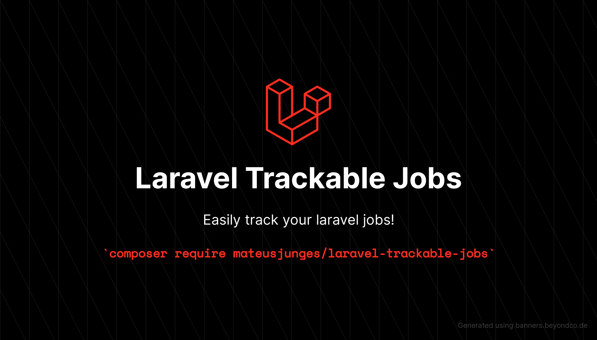

# Trackable Jobs For Laravel


[](https://packagist.org/packages/mateusjunges/laravel-trackable-jobs)
[](https://packagist.org/packages/mateusjunges/laravel-trackable-jobs)
[](LICENSE.md)
[](https://github.com/mateusjunges/trackable-jobs-for-laravel/actions/workflows/php-cs-fixer.yml)
[](https://github.com/mateusjunges/trackable-jobs-for-laravel/actions/workflows/run-tests.yml)

# Sponsor my work!
If you think this package helped you in any way, you can sponsor me on GitHub!

[](https://github.com/sponsors/mateusjunges)

# Documentation

## Installation and setup
To install this package, you must be running php v8.0 or higher, as well as laravel v9.x or higher.

Use composer:
```bash
composer require mateusjunges/laravel-trackable-jobs
```

You can publish the configuration file and the migration with this command:

```bash
php artisan vendor:publish --tag=trackable-jobs-assets
```

Run `php artisan migrate` to migrate the table needed by this package, and now you are good to go!

## Tracking Jobs

To start tracking your jobs, you just need to extend the base `\Junges\TrackableJobs\TrackableJob` class in the job you want to track. For example, let's say you want to track the status of `ProcessPodcastJob`:

```php
<?php

namespace App\Jobs;

use Illuminate\Bus\Queueable;
use Illuminate\Contracts\Queue\ShouldQueue;
use Illuminate\Foundation\Bus\Dispatchable;
use Illuminate\Queue\InteractsWithQueue;
use Illuminate\Queue\SerializesModels;
use Junges\TrackableJobs\TrackableJob;

class ProcessPodcastJob extends TrackableJob implements ShouldQueue
{
    use Dispatchable, InteractsWithQueue, Queueable, SerializesModels;

    public function handle()
    {
        //
    }
}
```

This package will store the last status of your job, which can be `created`, `queued`, `started`, `failed` or `finished`. Also, it stores the
`started_at` and `finished_at` timestamps for each tracked job.

To use it, you just need to pass any model to your Job constructor:

```php
dispatch(new ProcessPodcastJob($podcast));
```

Once this trait is added to your job, your job progress will be persisted to the database. You can configure the table name by publishing this package configuration file:

```shell
php artisan vendor:publish --tag=trackable-jobs-config
```

This command will create a new config file in `config/trackable-jobs.php`, with this content:

```php
<?php

return [
    /*
     | The table where the tracked jobs will be stored.
     | By default, it's called 'tracked_jobs'.
     */
    'tables' => [
        'tracked_jobs' => 'tracked_jobs',
    ],
    'using_uuid' => false,
];
```

## Associating tracked jobs with a model
Associating a tracked job with a model is specially useful if you want to track the steps to achieve something.
Let's say you are using job chains for releasing your new podcast. Here's an example:

```php
Bus::dispatchChain([
    new OptimizePodcast($podcast),
    new CompressPodcast($podcast),
    new ReleasePodcast($podcast)
])->dispatch();
```

Job chain are a nice and fluent way of saying "Run this jobs sequentially, one after the previous one is complete.".

In this case, it might be useful to relate all jobs in this chain to the main `$podcast` model.
You can achieve that by overriding the `trackableType` and `trackableKey` in each one of the jobs in your chain:

```php
public function trackableType(): ?string
{
    return $this->podcast->getMorphClass();
}

public function trackableKey(): ?string
{
    return (string) $this->podcast->id;
}
```

Now, this package will automatically relate tracked jobs to the podcast model passed in the job constructor.

You can get all the `steps` by adding a relationship to your `Podcast` model:

```php
public function steps(): \Illuminate\Database\Eloquent\Relations\MorphMany
{
    return $this->morphMany(Junges\TrackableJobs\Models\TrackedJob::class, 'trackable');
}
```


Now, you can have the status of each job that should be processed to release your podcast:

```php
$steps = Podcast::find($id)->steps;
```

## Persist job Output
To persist the output of your job to the database, you only need to return something from your job. By default, if your job throws an exception, the output stored in the database will be the message of the given exception. If your job finishes successfully, you don't have to return anything, but you can store it's output by just returning something after the job is done. For example:

```php
public function handle()
{
    //Do your stuff here
    
    return "Job finished successfully";
}
```
The string `Job finished successfully` will be stored as the output of this job.

The output returned by your job will be stored as `json`.

## Extending the tracked job model

If, for some reason, you need to use your own custom model to the TrackedJob table, you can just create a new model
and extend the existing `Junges\TrackableJobs\Models\TrackedJob::class`.
Then, you need to bind the `Junges\TrackableJobs\Contracts\TrackableJobContract` to the new model, within your `AppServiceProvider`:

```php
<?php

namespace App\Providers;

use App\Models\YourCustomModel;
use Illuminate\Support\ServiceProvider;
use Junges\TrackableJobs\Contracts\TrackableJobContract;

class AppServiceProvider extends ServiceProvider
{
    /**
     * Register any application services.
     *
     * @return void
     */
    public function register()
    {
        $this->app->bind(TrackableJobContract::class, YourCustomModel::class);
    }
}
```

## Using UUIDs
To use UUIDs with this package, the only additional configuration you need to do is change the `using_uuid` to `true`, in `config/trackable-jobs.php`.
Then it will automatically start using UUID's to store the tracked jobs and, if the model related to the tracked job
also uses UUID, it will be stored to the database in the `trackable_id` field.

## Pruning tracked jobs
If you want to prune your old tracked jobs, you can set the `prunable_after` config with the amount of days you want your models
to keep in your database. For example, if you set the `prunable_after` to `30`, all models older than 30 days
will be deleted.


# Tests
Run `composer test` to test this package.

# Contributing
Thank you for consider contributing for the Laravel Trackable Jobs package! The contribution guide can
be found [here][contributing].

# Changelog
Please see the [changelog][changelog] for more information about the changes on this package.

# Credits
- [All contributors][contributors]

# License
The laravel trackable jobs is open-sourced software licensed under the terms of [MIT License][mit]. Please see the [license file][license] for more information.

[contributing]: CONTRIBUTING.md
[changelog]: CHANGELOG.md
[mit]: https://opensource.org/licenses/MIT
[license]: LICENSE
[contributors]: https://github.com/mateusjunges/trackable-jobs-for-laravel/graphs/contributors
